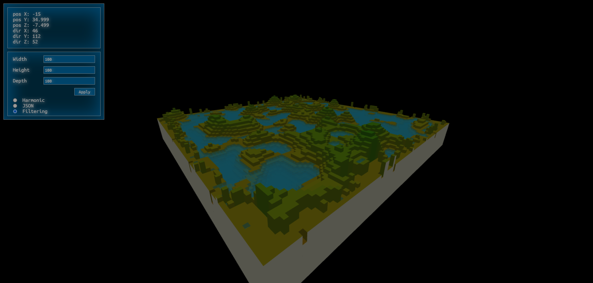

# Water-pool
Generating a "pool" made of blocks of different heights.
Solving a problem of filling a pool with water to find water heights.
Algorithm complexity: .

Rendering all that with ThreeJS.

Demo: https://water-pool.herokuapp.com/

Tasks
- Move solving to server-side (Java). Return only faces and colors.
Alternatively: return array of heights (ground + water). 

