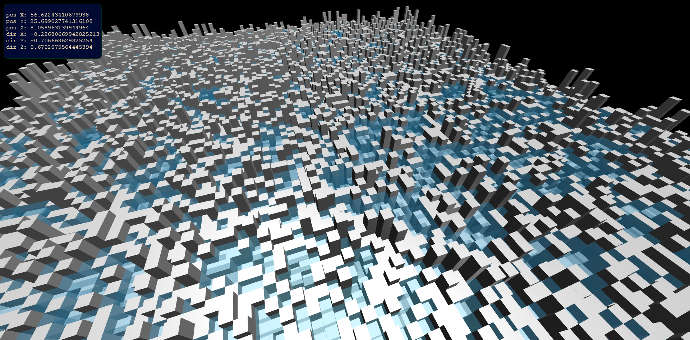

# pool-filling
Generating a "pool" made of blocks of different heights.
Solving a problem of filling a pool with water to find water heights.
Algorithm complexity: .

Rendering all that with ThreeJS.

